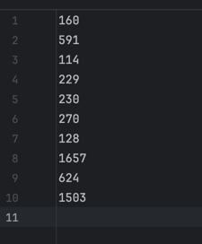
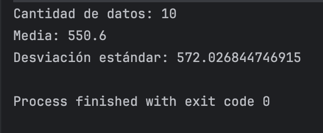

# Escuela Colombiana de Ingeniería Julio Garavito
## Tarea OO Design Assignment Kit
### Autor: Juan David Zambrano González

---

## Descripción 
Este repositorio contiene la solución a la tarea **OO Design Assignment Kit**.
El objetivo es implementar un programa en **Java** que calcule la **media** y la **desviación estándar** de un conjunto de números reales leídos desde un archivo, utilizando una **lista enlazada implementada manualmente** en lugar de las colecciones estándar de Java.

---

## Funcionalidad
El programa permite:
1. **Leer números reales desde un archivo de texto** (`numbers.txt`).
2. **Almacenarlos en una lista enlazada personalizada**.
3. **Calcular la media (promedio)** de los valores.
4. **Calcular la desviación estándar**, como medida de dispersión.
5. Mostrar los resultados en consola.

---

## Explicación de las clases 

### `Node<T>`
- Es la **pieza básica** de la lista enlazada.
- Guarda un **dato** y un **enlace al siguiente nodo**.

---

### `LinkedList<T>`
- Es la **lista enlazada**.
- Une varios `Node` uno detrás de otro.
- Permite:
    - **Agregar** datos al final.
    - **Contar** cuántos elementos tiene.
    - **Saber** si está vacía.
    - **Recorrer** todos los elementos.

---

### `Statistics`
- Es la clase que hace las **matemáticas**.
- Tiene dos funciones:
    - `mean(...)` → saca el **promedio** de los números.
    - `standardDeviation(...)` → calcula la **desviación estándar**.

---

### `Main`
- Es el **corazón del programa**.
- Se encarga de:
    1. Leer los números del archivo `numbers.txt`.
    2. Guardarlos en la `LinkedList`.
    3. Llamar a `Statistics` para hacer los cálculos.
    4. Mostrar los resultados en la pantalla.

---

## Pruebas

